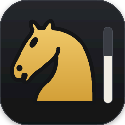
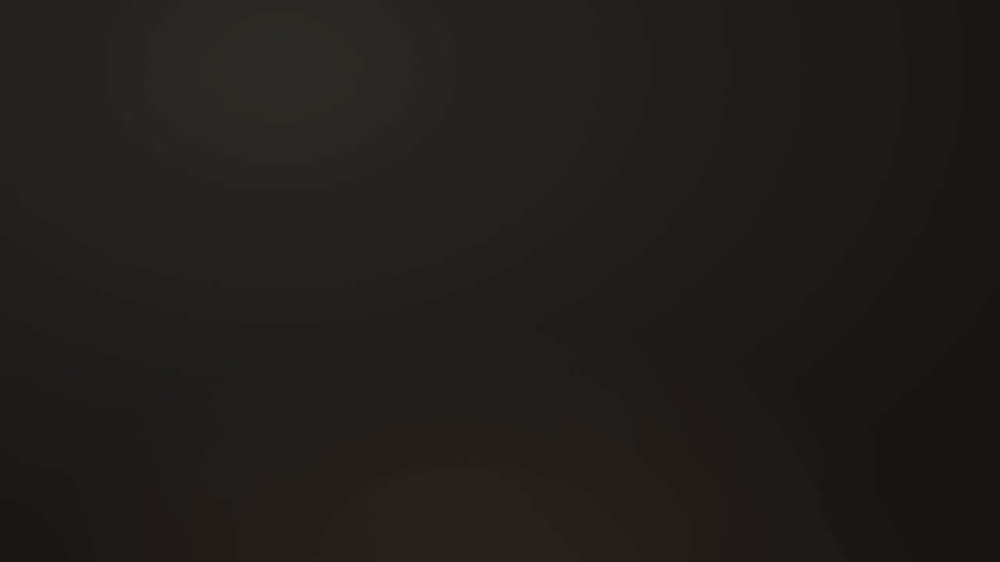
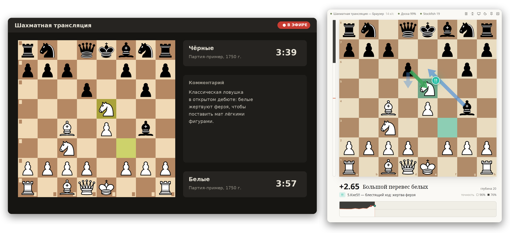
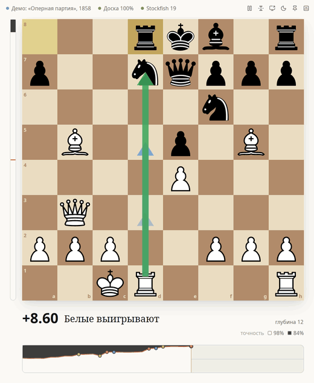
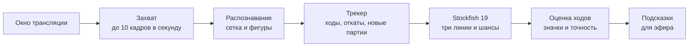
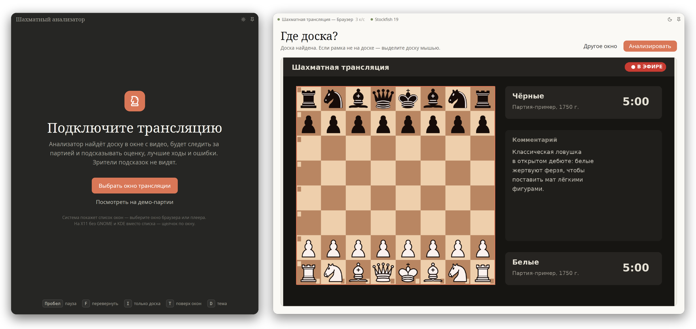
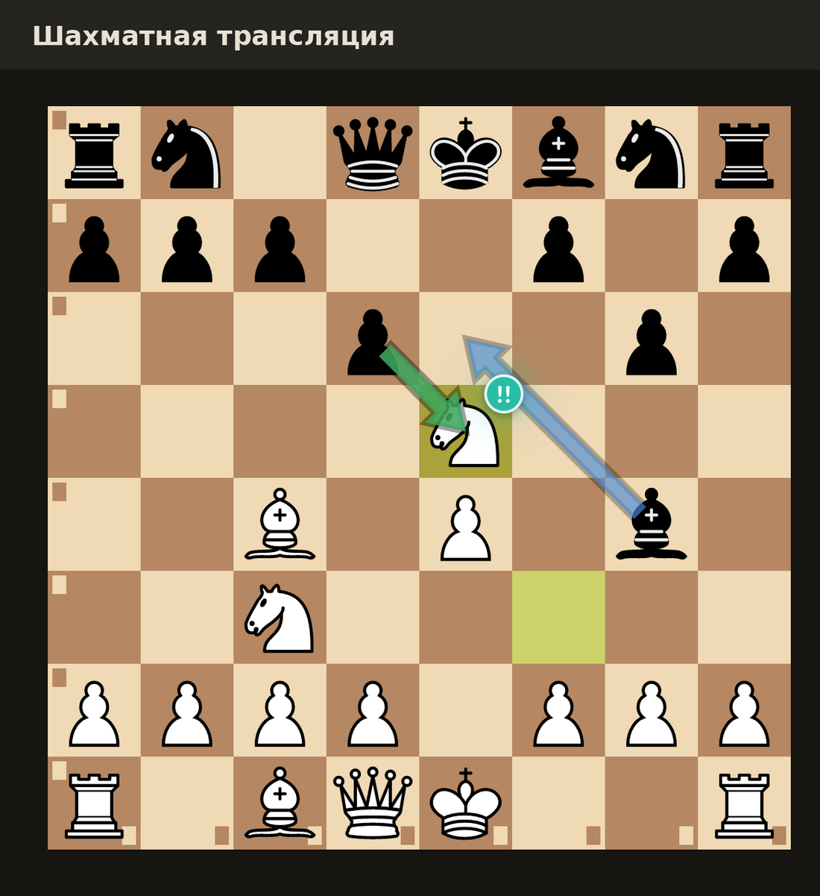

<div align="center">



# Шахматный анализатор

**Суфлёр комментатора шахматных трансляций**

Смотрит в окно с трансляцией, сам находит на нём доску и ход за ходом<br>
подсказывает оценку Stockfish 19, лучшие продолжения, ошибки и находки —<br>
вам, а не зрителям.

**[Скачать для Windows, Linux и macOS](https://github.com/NikitaSytsevich/chess-analyzer/releases/latest)**

[](https://github.com/NikitaSytsevich/chess-analyzer/releases/latest)
[](https://github.com/NikitaSytsevich/chess-analyzer/actions/workflows/ci.yml)


[](LICENSE)

<br>



<sub>Настоящая запись анализатора: мат Легаля от подключения трансляции до стрелок на ней.</sub>

</div>

## Зачем он нужен

Комментатор ведёт трансляцию и в каждый момент должен понимать, что происходит
на доске: кто лучше и насколько, что здесь сильнейшее, был ли последний ход
ошибкой или находкой. В блице удержать всё это в голове невозможно,
а переключаться на отдельный анализ — значит отвлекаться от эфира.

Анализатор стоит рядом с окном трансляции — или поверх него — и отвечает на
эти вопросы сам, в реальном времени. Он не подключается к сайтам — просто
смотрит на выбранное окно, как зритель, и поэтому работает с любой
трансляцией: Lichess, Chess.com, YouTube, Twitch, запись в плеере. А если
нужно, кладёт стрелки лучших ходов и значки ходов прямо на доску в окне
трансляции у вас на экране.

<div align="center">

<br>
<sub>Мат Легаля. 5.Кxe5 оставляет ферзя под боем, и анализатор сразу отмечает жертву бирюзовым «!!».</sub>
</div>

## Что он умеет



- **Находит доску сам.** В окне браузера или плеера — по границам клеток;
  узнаёт наборы фигур Lichess, а фигуры Chess.com выучивает по ходу партии.
- **Следит за партией ход за ходом.** Дожидается конца анимации хода,
  проверяет всё правилами шахмат и понимает пропущенный ход, откат, новую
  партию и доску, повёрнутую к чёрным.
- **Считает Stockfish 19 в реальном времени.** Три лучших продолжения —
  стрелками на доске, шкала оценки, оценка числом и словами: «Равная
  позиция», «Перевес белых», «Чёрные выигрывают».
- **Ставит значок каждому ходу** — прямо на доске, как на Chess.com, от
  `!!` до `??`. Получает его и ход, закончивший партию: мат — лучший ход,
  а пат в выигранной позиции — зевок.
- **Рисует прямо на трансляции** — по клавише `A`: стрелки лучших ходов и
  значок последнего хода ложатся на доску в окне трансляции, и взгляд не
  нужно переводить на анализатор. Щелчки проходят сквозь них к трансляции.
- **Подсказывает фразами для эфира:** «16.Фb8+!! — блестящий ход: жертва
  ферзя ради мата», «У чёрных единственный ход: 24…Кf6», «Белые ставят мат
  в 2 хода: 25.Фh7+ Крf8 26.Фh8#».
- **Считает точность сторон** по формуле Lichess и рисует график партии
  с отметками ошибок и находок.
- **Не мешает трансляции.** `I` оставляет только доску со шкалой, `T`
  держит окно поверх всех окон — даже над браузером во весь экран.
- **Подстраивается под систему:** светлая и тёмная тема, как в ней; `D`
  переключает вручную.
- **Отдаёт партию:** позицию в FEN, всю партию в PGN с оценками и знаками —
  её откроют Lichess и ChessBase.
- **Работает у вас на компьютере.** Ни сервера, ни учётной записи, ни
  телеметрии. Свободная программа под GPL-3.0.

<sub>Справа — финал «Оперной партии» (Морфи, 1858) в демо-режиме: 16.Фb8+!!
и 17.Лd8#.</sub>
<br clear="right">

## Значки ходов

Значок появляется над фигурой, которая сходила, как только оценка устоится,
и потом только уточняется. Цвета различимы при дальтонизме и всегда идут
вместе со знаком.

| Ход | Когда ставится |
|---|---|
| &nbsp; **Блестящий** `!!` | Жертва, которая работает: ход отдаёт фигуру — соперник её берёт или не может взять без потерь, — а позиция после хода не хуже равной. В уже выигранной позиции — только жертва ради мата. |
| &nbsp; **Сильный** `!` | Единственный ход: любой другой проигрывает столько, что был бы зевком. Взятие в ответ на взятие — просто размен, не находка. |
| &nbsp; **Лучший** | Первый выбор движка — или ход не хуже него. |
| &nbsp; **Хороший** | Потеряно меньше 5% шансов на победу. |
| &nbsp; **Неточность** `?!` | Потеряно от 5 до 10%. |
| &nbsp; **Ошибка** `?` | От 10 до 15%. |
| &nbsp; **Зевок** `??` | Больше 15%. Если выигрыш был и ушёл, подсказка так и скажет: «выигрыш упущен». |

У подсказок под доской есть ещё два знака:
 —
единственный ход в текущей позиции (так его обозначает Шахматный
информатор) и 
— форсированный мат.

<details>
<summary><b>Как считаются шансы, точность и классы</b></summary>

<br>

- **Шансы на победу** — по той же кривой, что у Lichess:
  `50 + 50 · (2 / (1 + e^(−0.00368·cp)) − 1)` процентов, где `cp` — оценка
  в сотых долях пешки. Пороги `?!`, `?` и `??` — тоже как у Lichess: 5, 10
  и 15 процентов. Зрители привыкли к этим значкам: анализатор говорит на
  том же языке, что и разбор партии на Lichess.
- **Когда значок появляется.** Позиция после хода должна быть досчитана до
  глубины 14 — раньше класс ещё скачет между «лучшим» и «неточностью».
  Ошибки и зевки — большие перепады оценки — показываются сразу с глубины
  10. К глубине 18 класс становится окончательным.
- **Первый выбор движка никогда не ошибка**, даже если на большей глубине
  оценка после него просела: передумал движок, а не игрок.
- **Жертва** — ход, после которого соперник бьёт сходившую фигуру и через
  несколько ходов лучшей защиты материала у сходившего меньше, чем до хода,
  — или ход, который оставляет под боем фигуру, выгодную для взятия хотя бы
  на две пешки. Решает, работает ли жертва, движок: ход должен быть лучшим.
- **Точность** — формула Lichess: потеря шансов переводится в проценты
  точности хода, а за партию берётся среднее обычного и гармонического
  среднего — так один зевок виден в итоге.

</details>

## Как он работает



1. **Захват.** Окно выбирает сам комментатор в системном окне выбора:
   программа не перебирает чужие окна и не просит лишних прав. Пока ищем
   доску, захватывается всё окно; потом — только доска с небольшим полем.
2. **Распознавание.** Доска ищется по границам клеток: на них цвет
   скачком меняется по всей высоте доски. Каждая клетка сравнивается
   с шаблонами фигур, положенными на её собственный фон, — поэтому
   подсветка последнего хода и стрелки не мешают. Кадр разбирается
   за 2–3 мс.
3. **Трекер.** Ждёт, пока расстановка устоится, и ищет самое
   правдоподобное объяснение: ход, два хода подряд, откат или новая
   позиция. Правила шахмат — главный фильтр: ошибка распознавания в одной
   клетке не превращается в «ход» ладьёй сквозь фигуры.
4. **Движок.** Stockfish 19 в отдельном процессе получает каждую новую
   позицию вместе с историей партии и присылает три лучшие линии десять
   раз в секунду. Оценки кэшируются: после отката глубокий анализ не
   теряется.
5. **Оценка и подсказки.** Сыгранный ход сравнивается с лучшим ходом
   позиции до него — так появляются значки, точность и фразы для эфира.

## Установка

| Система | Сборка | Захват окна трансляции |
|---|---|---|
| Windows 10 (1903+) и 11 | готовая или из исходников | системный выбор окна (Windows.Graphics.Capture) |
| Linux, X11 и Wayland | готовая или из исходников | системный выбор через портал рабочего стола (GNOME, KDE); без портала — щелчок по окну |
| macOS 15+, Apple Silicon | готовая или из исходников | системный выбор окна (ScreenCaptureKit), без разрешения «Запись экрана» |

Stockfish 19 входит в каждую сборку. Без трансляции программу можно
посмотреть на демо-партии: кнопка «Посмотреть на демо-партии» на первом
экране или запуск с ключом `--demo`.

### Windows

**Готовая сборка:** [страница релизов](https://github.com/NikitaSytsevich/chess-analyzer/releases/latest) →
`chess-analyzer-windows-x64.zip`. Распакуйте архив куда угодно и
запустите `Шахматный анализатор.exe`. Сборка не подписана, поэтому при
первом запуске Windows может показать «Windows защитила ваш компьютер» —
нажмите «Подробнее» → «Выполнить в любом случае».

Пока окно захватывается, Windows обводит его жёлтой рамкой. Её видите
только вы; на Windows 11 анализатор просит её не рисовать.

<details>
<summary>Сборка из исходников</summary>

1. **Visual Studio Build Tools 2022** —
   <https://visualstudio.microsoft.com/visual-cpp-build-tools/>. В установщике
   отметьте «Разработка классических приложений на C++»: в неё входят
   компилятор MSVC и Windows SDK (из SDK берётся компилятор шейдеров `fxc.exe`).
2. **Rust** — <https://rustup.rs>, установка по умолчанию. Нужную версию
   Rust проект поставит сам.
3. **Git** — <https://git-scm.com/download/win>.
4. Скачайте проект в короткий путь без пробелов — у Windows есть предел
   длины пути, а сборка GPUI создаёт глубокие папки:

   ```powershell
   git clone https://github.com/NikitaSytsevich/chess-analyzer C:\dev\chess-analyzer
   cd C:\dev\chess-analyzer
   cargo xtask run --release
   ```

   Первая сборка идёт 10–20 минут. Команда сама скачает Stockfish 19
   (с проверкой контрольной суммы) и запустит приложение. Готовая папка —
   `target\release\Шахматный анализатор\`.

</details>

### Linux

**Готовая сборка:** [страница релизов](https://github.com/NikitaSytsevich/chess-analyzer/releases/latest) →
`chess-analyzer-linux-x64.tar.gz`:

```sh
tar -xzf chess-analyzer-linux-x64.tar.gz
cd "Шахматный анализатор"
./chess-analyzer            # запустить
./install.sh                # добавить ярлык в меню приложений (./install.sh --remove — убрать)
```

Нужны библиотека PipeWire и драйвер Vulkan — они есть в любом современном
дистрибутиве (Ubuntu 22.04+, Fedora, Debian 12+, Arch).

Окно трансляции выбирается так, как принято в вашем окружении:

- **GNOME и KDE** — и на Wayland, и на X11 — показывают системный выбор
  окна (портал рабочего стола), кадры идут по PipeWire.
- **Sway, Hyprland и другие wlroots** — тоже через портал; если он умеет
  отдавать только экран целиком, анализатор найдёт доску и на нём.
- **X11 без портала** (Xfce, MATE, i3 и другие) — курсор становится
  перекрестьем: щёлкните по окну трансляции, `Esc` — отмена. Окно читается,
  даже когда его частично закрывает сам анализатор.

«Поверх всех окон» на X11 включает сам анализатор (`T`); на Wayland это
позволено только пользователю — через меню окна.

<details>
<summary>Сборка из исходников</summary>

Ubuntu 24.04+ и Debian 13+ — сборке нужны заголовки PipeWire 1.0 или
новее (на Ubuntu 22.04 проще скачать готовую сборку, она там работает):

```sh
sudo apt install build-essential git curl pkg-config clang libclang-dev \
  libxkbcommon-dev libxkbcommon-x11-dev libxcb1-dev libwayland-dev \
  libvulkan-dev libfontconfig-dev libfreetype-dev libpipewire-0.3-dev
curl https://sh.rustup.rs -sSf | sh && . "$HOME/.cargo/env"
git clone https://github.com/NikitaSytsevich/chess-analyzer
cd chess-analyzer
cargo xtask run --release
```

Команда скачает Stockfish 19 для x86-64 или arm64 и соберёт папку
`target/release/Шахматный анализатор/`. Подойдёт и Stockfish из
репозитория дистрибутива (`sudo apt install stockfish`) — анализатор
найдёт его сам.

</details>

### macOS

**Готовая сборка:** [страница релизов](https://github.com/NikitaSytsevich/chess-analyzer/releases/latest) →
`chess-analyzer-macos-arm64.dmg`. Откройте образ и перетащите программу в
«Программы». Сборка не заверена Apple, поэтому в первый раз macOS её не
откроет: зайдите в «Системные настройки» → «Конфиденциальность и
безопасность» и разрешите открыть «Шахматный анализатор» кнопкой внизу
раздела.

Окно трансляции выбирается в системном окне macOS — разрешение «Запись
экрана» не понадобится.

<details>
<summary>Сборка из исходников</summary>

Нужны Command Line Tools 26 или новее (`xcode-select --install`): графике
GPUI нужен SDK macOS 26. Ещё нужен Rust (<https://rustup.rs>); Xcode не нужен.

```sh
git clone https://github.com/NikitaSytsevich/chess-analyzer
cd chess-analyzer
cargo xtask run
```

Команда скачает Stockfish, соберёт «Шахматный анализатор.app» в `target/`
и запустит его.

</details>

## Как пользоваться

<div align="center">

<br>
<sub>С первого экрана — выбор окна трансляции или демо-партия. Доску в окне
анализатор находит сам и обводит рамкой; если ошибся, выделите доску мышью.</sub>
</div>

1. Нажмите **«Выбрать окно трансляции»** и укажите окно браузера или плеера.
2. На экране **«Где доска?»** проверьте рамку и нажмите **«Анализировать»**.
3. Поставьте окно рядом с трансляцией. `I` оставит только доску, `T`
   поднимет окно над всеми остальными.

Если распознавание ошиблось с очередью хода или рокировкой, скопируйте FEN
с сайта трансляции и вставьте его: `⌘V` / `Ctrl+V`.

### Стрелки на трансляции

<div align="center">

<br>
<sub>Мат Легаля прямо в окне трансляции: «!!» над конём e5 и лучшие ответы
чёрных — стрелками поверх видео.</sub>
</div>

`A` кладёт стрелки лучших ходов и значок последнего хода прямо на доску в
окне трансляции — те же, что на доске анализатора, чтобы не переводить
взгляд. Лучший ход — зелёная стрелка; синие появляются, только если другой
ход почти не хуже (теряет меньше, чем неточность): над живой трансляцией
меньше — лучше. Когда стрелки появляются, доску на миг обводит рамка —
видно, что они легли точно.

Стрелки — прозрачное окно ровно над доской трансляции:

- щелчки проходят сквозь него к трансляции, а фокус оно не забирает;
- оно держится над трансляцией, даже когда по ней щёлкают или анализатор
  свёрнут, но не над другими окнами: окно, которое закрывает доску
  трансляции, закрывает и стрелки;
- оно следует за окном трансляции, когда его двигают;
- оно прячется, пока окно трансляции свёрнуто или на другом рабочем столе,
  пока анализ на паузе и пока распознавание не уверено в доске (например,
  окно трансляции изменило размер), — и возвращается, как только доска снова
  прочитана уверенно. Помогает и `R` — найти доску заново.

Где работает:

- **Windows 10 и 11, macOS** — всегда. На Windows (с версии 10 2004)
  стрелки не видны захвату экрана: даже если OBS снимает весь экран, в эфир
  они не попадут. На macOS такой запрет соблюдают не все программы захвата —
  в OBS снимайте окно браузера, а не экран.
- **Linux** — в сеансе X11, если окно трансляции выбрано щелчком (X11 без
  портала: Xfce, MATE, Cinnamon, i3) и работает композитор — без него
  прозрачное окно было бы чёрным. Через портал рабочего стола и на Wayland
  система не сообщает, где окно трансляции, и стрелок поверх неё нет.

### Клавиши

| Клавиша | Действие |
|---|---|
| `Пробел` | пауза анализа |
| `F` | перевернуть доску |
| `R` | найти доску заново |
| `I` | только доска / доска с оценкой и графиком |
| `A` | стрелки и значки ходов поверх трансляции |
| `T` | поверх всех окон |
| `D` | светлая / тёмная тема |
| `⌘O` / `Ctrl+O` | выбрать другое окно трансляции |
| `⌘C` / `Ctrl+C` | скопировать позицию (FEN) |
| `⇧⌘C` / `Ctrl+Shift+C` | скопировать партию (PGN с оценками и знаками) |
| `⌘V` / `Ctrl+V` | задать позицию из FEN |

## Устройство

Программа написана на Rust. Интерфейс — [GPUI](https://github.com/zed-industries/zed),
тот же, что у редактора Zed; движок — [Stockfish 19](https://stockfishchess.org).

```
crates/
  chess     партия, нотация (русская и английская), оценки, классы ходов, точность, PGN
  engine    Stockfish по UCI: отдельный поток, троттлинг, перезапуск при падении
  vision    поиск доски на кадре, распознавание фигур, обучение незнакомым наборам
  tracker   ход за ходом по потоку распознанных досок: откаты, смена партии
  capture   захват окна: ScreenCaptureKit, Windows.Graphics.Capture, портал и PipeWire, X11
  session   всё вместе: кадры → партия → анализ → оценки и подсказки
  app       окно на GPUI
  cli       тот же конвейер в терминале: cargo run -p analyzer-cli -- demo
xtask/      загрузка Stockfish, иконки, упаковка приложения, проверки
```

Ядро — всё, кроме `app` и `capture`, — не зависит ни от системы, ни от
интерфейса и проверяется тестами, в том числе на синтетических кадрах
трансляции. Перед коммитом: `cargo xtask ci` (rustfmt, clippy без
предупреждений, тесты). Проверки с настоящим Stockfish:
`cargo test -- --ignored` после `cargo xtask fetch-stockfish`.

Выпуск версии — это новая `version` в `Cargo.toml`. Когда она попадает в
`main`, Actions проверяют и собирают программу для Windows, Linux и macOS
и публикуют релиз `v<версия>` с готовыми файлами.

## Лицензия

GPL-3.0-or-later (см. [`LICENSE`](LICENSE)) — как у Stockfish и у наборов
фигур Lichess (cburnett, merida, chessnut; см.
[`assets/pieces/LICENSES.md`](assets/pieces/LICENSES.md)).
